# BLOG-CRUD.V2
Goal:  "회원가입, 로그인 기능이 추가된 나만의 항해 블로그 백엔드 서버 만들기"

---

## Lv.2 요구사항

1. 회원 가입 API
    - username, password를 Client에서 전달받기
    - username은  `최소 4자 이상, 10자 이하이며 알파벳 소문자(a~z), 숫자(0~9)`로 구성되어야 한다.
    - password는  `최소 8자 이상, 15자 이하이며 알파벳 대소문자(a~z, A~Z), 숫자(0~9)`로 구성되어야 한다.
    - DB에 중복된 username이 없다면 회원을 저장하고 Client 로 성공했다는 메시지, 상태코드 반환하기

   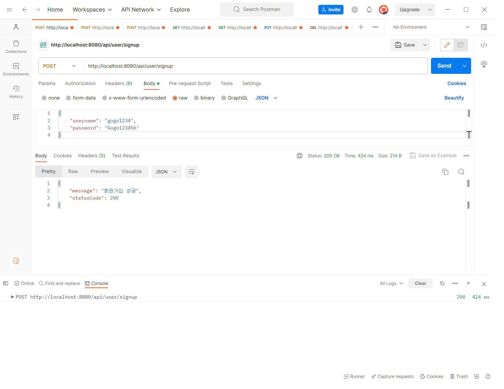

2. 로그인 API
    - username, password를 Client에서 전달받기
    - DB에서 username을 사용하여 저장된 회원의 유무를 확인하고 있다면 password 비교하기
    - 로그인 성공 시, 로그인에 성공한 유저의 정보와 JWT를 활용하여 토큰을 발급하고, 
    발급한 토큰을 Header에 추가하고 성공했다는 메시지, 상태코드 와 함께 Client에 반환하기

   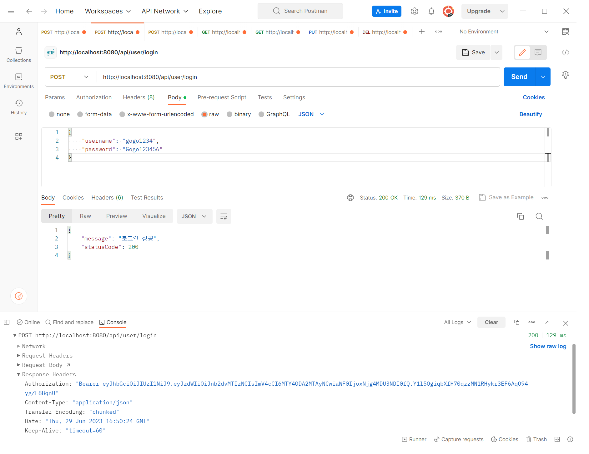

---

## 수정사항

1. 전체 게시글 목록 조회 API
    - 제목, 작성자명(username), 작성 내용, 작성 날짜를 조회하기
    - 작성 날짜 기준 내림차순으로 정렬하기

   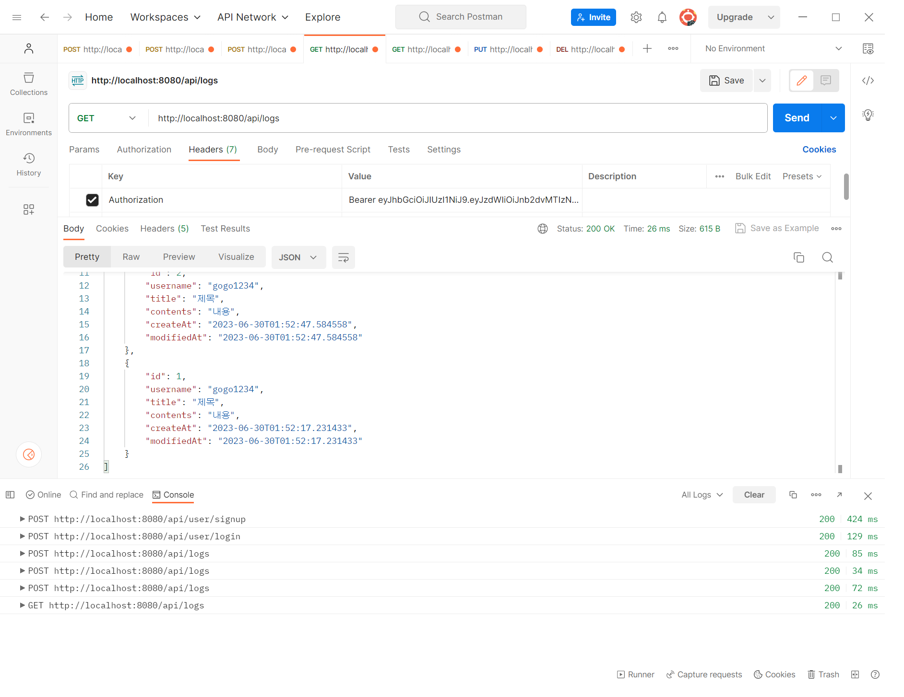
   
   
2. 게시글 작성 API
    - 토큰을 검사하여, 유효한 토큰일 경우에만 게시글 작성 가능
    - 제목, 작성 내용을 저장하고
    - 저장된 게시글을 Client 로 반환하기(username은 로그인 된 사용자)
   
   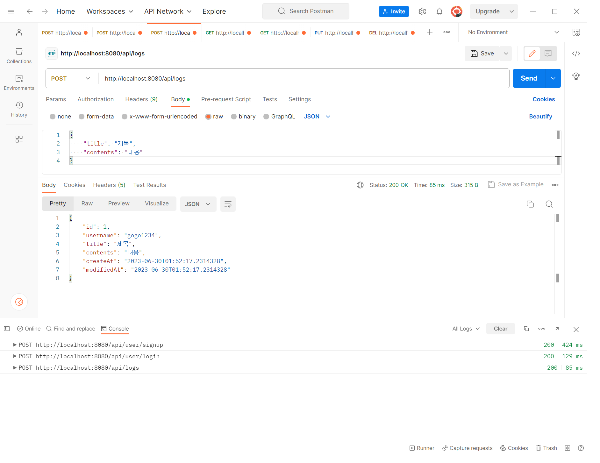
   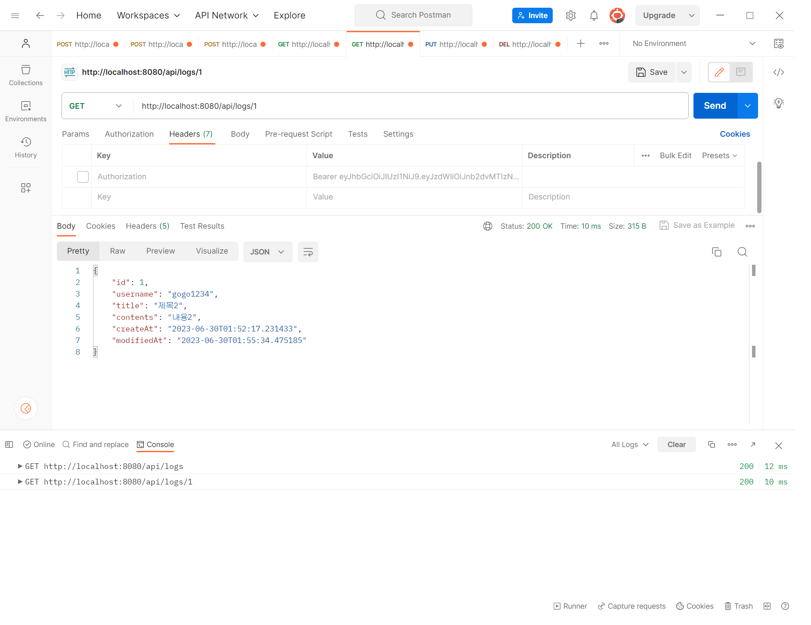
   
3. 선택한 게시글 조회 API
    - 선택한 게시글의 제목, 작성자명(username), 작성 날짜, 작성 내용을 조회하기 
    (검색 기능이 아닙니다. 간단한 게시글 조회만 구현해주세요.)
   
   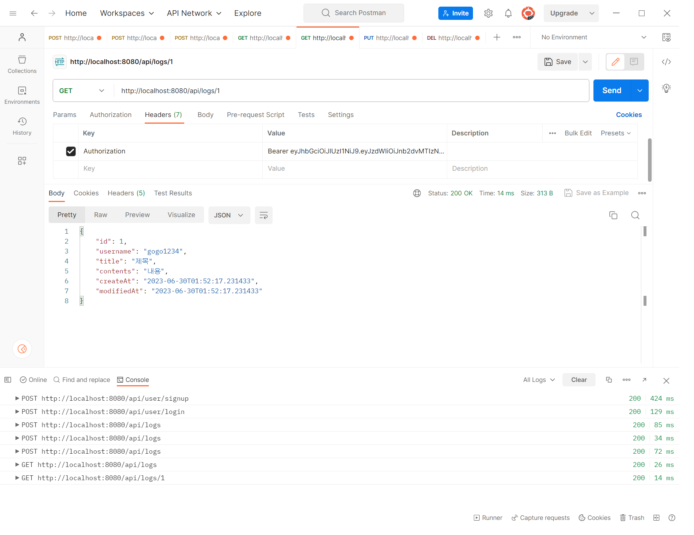
   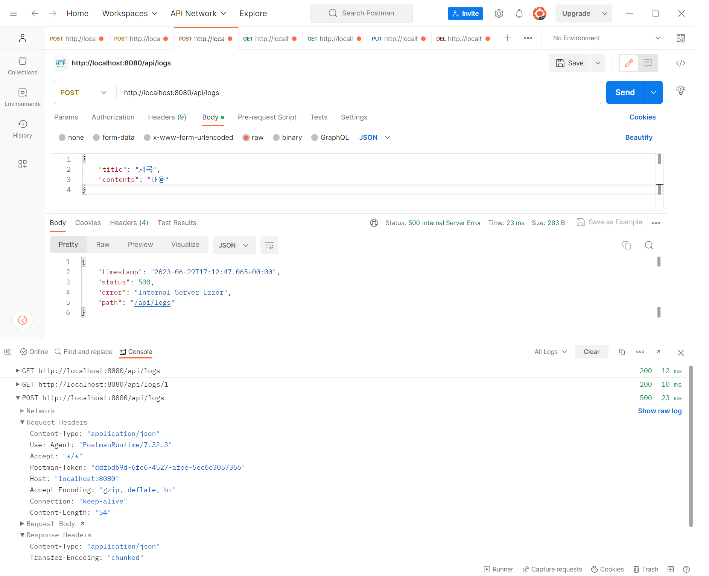

4. 선택한 게시글 수정 API
    - ~~수정을 요청할 때 수정할 데이터와 비밀번호를 같이 보내서 서버에서 비밀번호 일치 여부를 확인 한 후~~
    - 토큰을 검사한 후, 유효한 토큰이면서 해당 사용자가 작성한 게시글만 수정 가능
    - 제목, 작성 내용을 수정하고 수정된 게시글을 Client 로 반환하기
   
   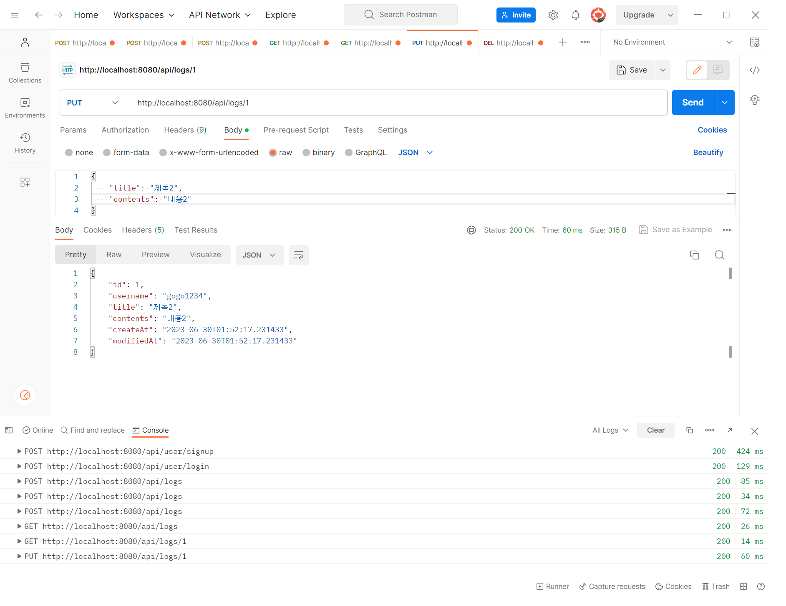
   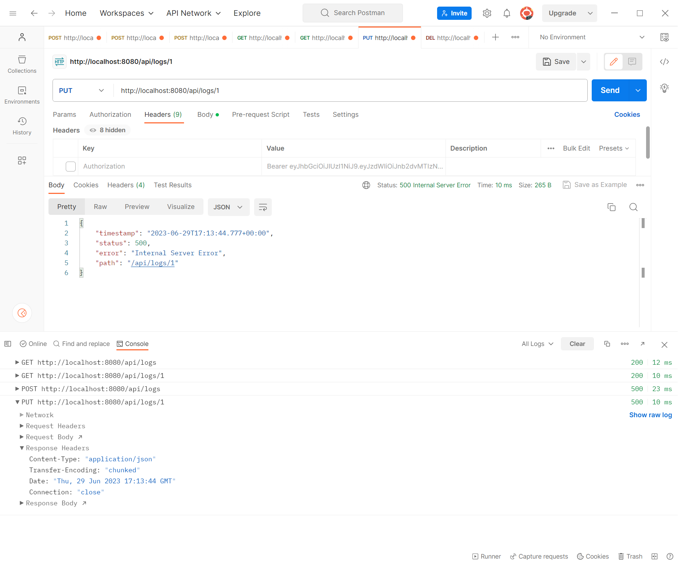
   
5. 선택한 게시글 삭제 API  
    - ~~삭제를 요청할 때 비밀번호를 같이 보내서 서버에서 비밀번호 일치 여부를 확인 한 후~~
    - 토큰을 검사한 후, 유효한 토큰이면서 해당 사용자가 작성한 게시글만 삭제 가능
    - 선택한 게시글을 삭제하고 Client 로 성공했다는 메시지, 상태코드 반환하기
   
   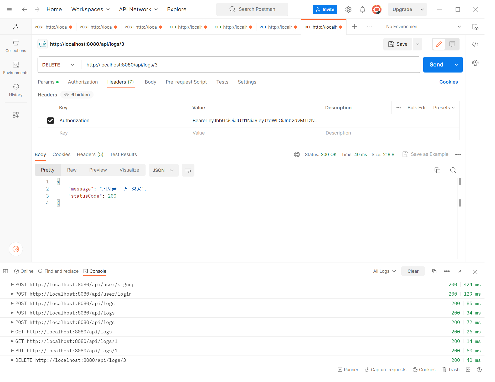
   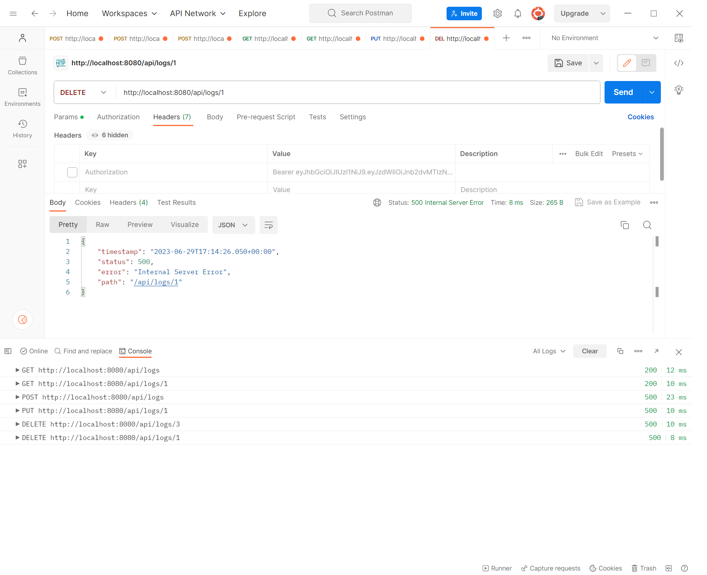

---

## Use Case

   

---

## ERD

   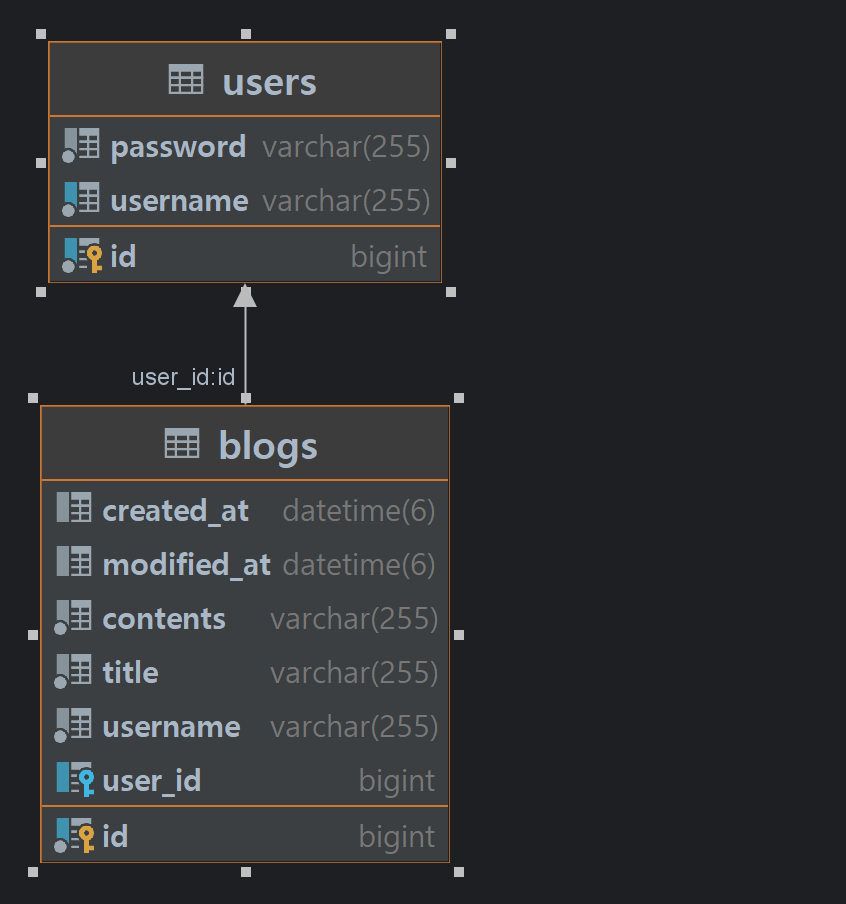

---

## API 명세서

   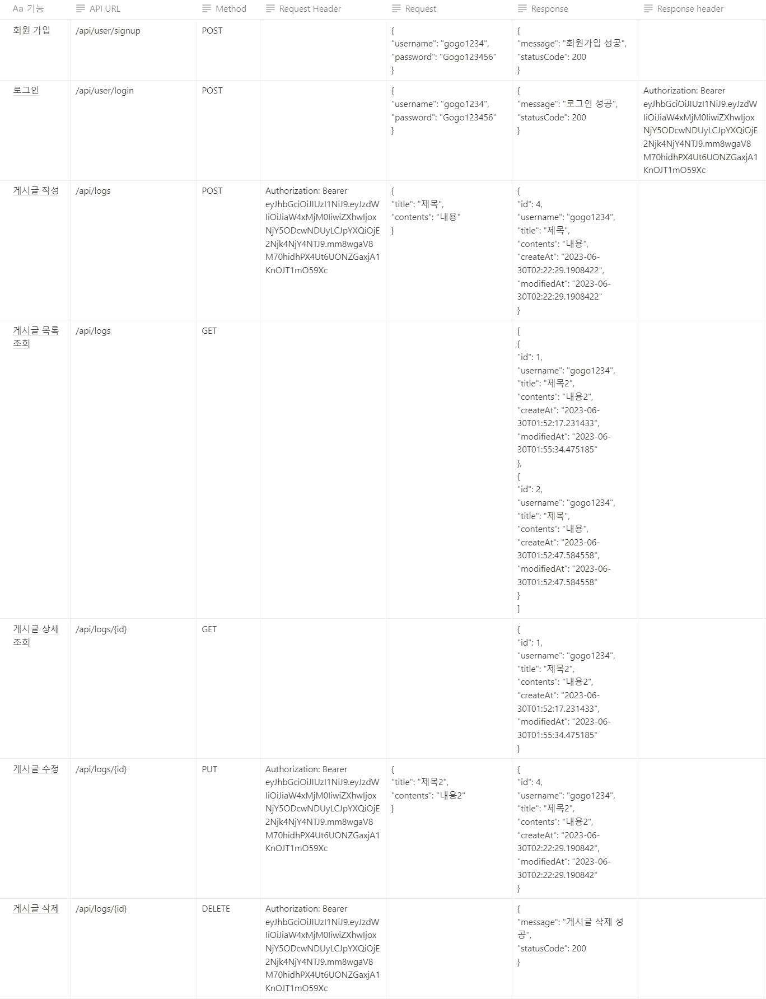

---
1. 처음 설계한 API 명세서에 변경사항이 있었나요?
   변경 되었다면 어떤 점 때문 일까요? 첫 설계의 중요성에 대해 작성해 주세요! 
- 튜터님이 알려주신 API URL 컨벤션에 따라 단수에서 복수로 변경하여 차후 추가 하더라도 유연하게 변경할 수 있도록 하였습니다.
2. ERD를 먼저 설계한 후 Entity를 개발했을 때 어떤 점이 도움이 되셨나요?
- 관계형 구조를 표현할 수 있는데 장점이 있는것 같지만 😢 이해를 못해 장점을 설명하기 어렵습니다. 복습을 통해 장점을 파악할 수 있도록 하겠습니다.
3. JWT를 사용하여 인증/인가를 구현 했을 때의 장점은 무엇일까요?
- 인증을 위한 별도의 저장소가 요구되지않아 빠른 인증처리, 확장성이 우수함
4. 반대로 JWT를 사용한 인증/인가의 한계점은 무엇일까요?
- 외부에서 접근하기 쉽고 노출 가능성으로 인해 저장할 수 있는 정보가 제한적이다
5. 만약 댓글 기능이 있는 블로그에서 댓글이 달려있는 게시글을 삭제하려고 한다면 무슨 문제가 발생할까요? Database 테이블 관점에서 해결방법이 무엇일까요?
- 외래키나 제약조건을 먼저 삭제 후 삭제합니다.
6. IoC / DI 에 대해 간략하게 설명해 주세요!
- 제어의 역전과 의존성 주입은 클래스 간의 느슨한 결합으로 코드의 유지보수 및 재활용을 용이하게 하는데 목적이 있습니다. 