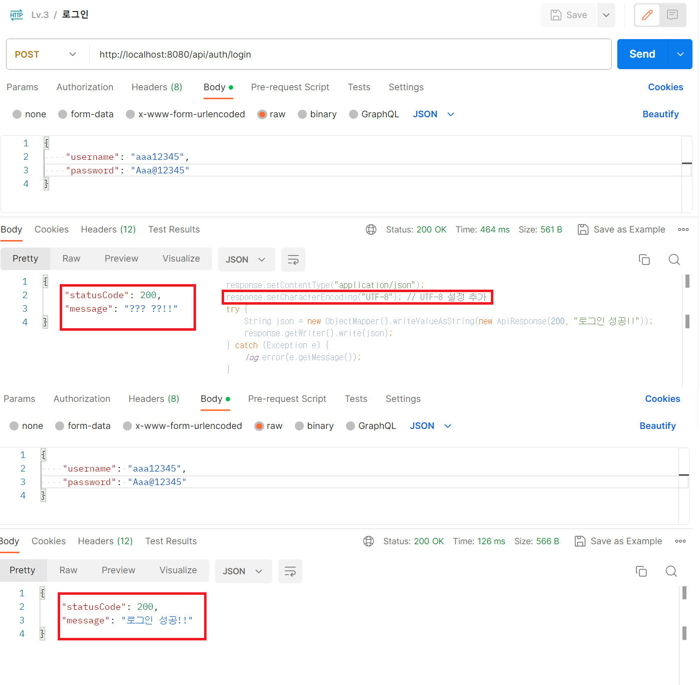

# BLOG-CRUD.V3
Goal:  "회원가입, 로그인 기능이 추가된 나만의 항해 블로그 백엔드 서버 만들기"

---

## Lv.3 요구사항

1. 회원 가입 API
    - username, password를 Client에서 전달받기
    - username은  `최소 4자 이상, 10자 이하이며 알파벳 소문자(a~z), 숫자(0~9), 특수문자`로 구성되어야 한다.
    - password는  `최소 8자 이상, 15자 이하이며 알파벳 대소문자(a~z, A~Z), 숫자(0~9)`로 구성되어야 한다.
   
   ```java
       public static class SignupRequestDto {
           @Size(min = 4, max = 10)
           @Pattern(regexp = "^[a-z0-9]*$")
           @NotBlank
           private String username;
   
           @Size(min = 8, max = 15)
           @Pattern(regexp = "^(?=.*[a-z])(?=.*[A-Z])(?=.*\\d)(?=.*[$@$!%*?&])[A-Za-z\\d$@$!%*?&]{8,15}")
           @NotBlank
           private String password;
   
           private boolean admin = false;
           private String adminToken = "";
       }
   ```
    - DB에 중복된 username이 없다면 회원을 저장하고 Client 로 성공했다는 메시지, 상태코드 반환하기
    - 회원 권한 부여하기(ADMIN, USER) - ADMIN 회원은 모든 글 수정삭제 가능
   -> `UserRoleEnum.class` 활용 접근제어매니저에 의존해 권한부여
   
   

2. 로그인 API
    - username, password를 Client에서 전달받기
    - DB에서 username을 사용하여 저장된 회원의 유무를 확인하고 있다면 password 비교하기
    - 로그인 성공 시, 로그인에 성공한 유저의 정보와 JWT를 활용하여 토큰을 발급하고, 
    발급한 토큰을 Header에 추가하고 성공했다는 메시지, 상태코드 와 함께 Client에 반환하기

   

   - 앞서 처리한 반환 값이 내마음 같아서 처리하지 못했다가 UTF-8 설정 코드를 찾아 추가하였다.  
   
   
   
3. 댓글 작성 API
   - ~~토큰을 검사하여, 유효한 토큰일 경우에만 댓글 작성 가능~~
   - 선택한 게시글의 DB 저장 유무를 확인하기
   - 선택한 게시글이 있다면 댓글을 등록하고 등록된 댓글 반환하기
   
   ```java
    public CommentResponseDto createComment(Long id, CommentRequestDto requestDto, User user) {
        Blog blog = blogRepository.findById(id).orElseThrow(
                () -> new NullPointerException("해당 게시글이 존재하지 않습니다.")
        );
        Comment comment = commentRepository.save(new Comment(requestDto, user, blog));

        return new CommentResponseDto(comment);
    }
   ```
   
4. 댓글 수정 API
   - 토큰을 검사한 후, 유효한 토큰이면서 해당 사용자가 작성한 댓글만 수정 가능
   - 선택한 댓글의 DB 저장 유무를 확인하기
   - 선택한 댓글이 있다면 댓글 수정하고 수정된 댓글 반환하기
   ```java
   @Transactional
   public ResponseEntity<?> updateComment(Long commentId, CommentRequestDto requestDto, User user) {
   Comment comment = findComment(commentId);
   if(!confirmUser(comment, user)){
   ApiResponse apiResponse = new ApiResponse();
   apiResponse.setMessage("본인만 수정 가능합니다.");
   apiResponse.setStatusCode(400);
   return new ResponseEntity<>(apiResponse, HttpStatus.BAD_REQUEST);
   }
   
           comment.updateComment(requestDto);
           return ResponseEntity.ok().body(new CommentResponseDto(comment));
       }
   ```
5. 댓글 삭제 API
   - 토큰을 검사한 후, 유효한 토큰이면서 해당 사용자가 작성한 댓글만 삭제 가능
   - 선택한 댓글의 DB 저장 유무를 확인하기
   - 선택한 댓글이 있다면 댓글 삭제하고 Client 로 성공했다는 메시지, 상태코드 반환하기
   ```java
    @Transactional
    public ResponseEntity<ApiResponse> deleteComment(Long commentId, User user) {
        ApiResponse apiResponse = new ApiResponse();

        Comment comment = findComment(commentId);

        if(!confirmUser(comment, user)){
            apiResponse.setMessage("본인만 삭제할 수 있습니다.");
            apiResponse.setStatusCode(400);
            return new ResponseEntity<>(apiResponse, HttpStatus.BAD_REQUEST);
        }

        commentRepository.delete(comment);

        apiResponse.setMessage("삭제 성공!!");
        return new ResponseEntity<>(apiResponse, HttpStatus.OK);
    }
   ```
6. 예외 처리
   - 토큰이 필요한 API 요청에서 토큰을 전달하지 않았거나 정상 토큰이 아닐 때는 "토큰이 유효하지 않습니다." 라는 에러메시지와 statusCode: 400을 Client에 반환하기
   - 토큰이 있고, 유효한 토큰이지만 해당 사용자가 작성한 게시글/댓글이 아닌 경우에는 “작성자만 삭제/수정할 수 있습니다.”라는 에러메시지와 statusCode: 400을 Client에 반환하기
   - DB에 이미 존재하는 username으로 회원가입을 요청한 경우 "중복된 username 입니다." 라는 에러메시지와 statusCode: 400을 Client에 반환하기
   - 로그인 시, 전달된 username과 password 중 맞지 않는 정보가 있다면 "회원을 찾을 수 없습니다."라는 에러메시지와 statusCode: 400을 Client에 반환하기
   ```java
   @Data // 모든 필드에 대한 게터, 유용한 toString 메서드 및 hashCode를 생성하고 모든 비일시적 필드를 확인하는 구현과 동일합니다. 최종이 아닌 모든 필드와 생성자에 대한 세터도 생성합니다. @Getter @Setter @RequiredArgsConstructor @ToString @EqualsAndHashCode와 같습니다.
   public class ApiResponse {
   
       private int statusCode;
       private String message;
   
       public ApiResponse() {
           this.statusCode = 200;
           this.message = null;
       }
   
       public ApiResponse(int statusCode, String message) {
           this.statusCode = statusCode;
           this.message = message;
       }

   }
   ```
   ```java
   // 공통 메서드
       private Comment findComment(Long commentId) {
        return commentRepository.findById(commentId).orElseThrow(
                () -> new NullPointerException("해당 댓글이 존재하지 않습니다.")
        );
    }

    private boolean confirmUser(Comment comment, User user) {
        UserRoleEnum userRoleEnum = user.getRole();
        return userRoleEnum != UserRoleEnum.USER || Objects.equals(comment.getUser().getId(), user.getId());
    }
   ```
---

## 수정사항

1. 전체 게시글 목록 조회 API
    - 제목, 작성자명(username), 작성 내용, 작성 날짜를 조회하기
    - 작성 날짜 기준 내림차순으로 정렬하기
   ```java
    public List<BlogResponseDto.ReadResponseDto> getBlogs() {
        return blogRepository.findAllByOrderByCreatedAtDesc().stream().map(BlogResponseDto.ReadResponseDto::new).toList();
    }
   ```
   
2. 게시글 작성 API
    - 토큰을 검사하여, 유효한 토큰일 경우에만 게시글 작성 가능
    - 제목, 작성 내용을 저장하고
    - 저장된 게시글을 Client 로 반환하기(username은 로그인 된 사용자)
   ```java
    public BlogResponseDto.CommonResponseDto createBlog(BlogRequestDto requestDto, User user) {
        Blog blog = blogRepository.save(new Blog(requestDto, user));
        return new BlogResponseDto.CommonResponseDto(blog);
    }
   ```
   
3. 선택한 게시글 조회 API
    - 선택한 게시글의 제목, 작성자명(username), 작성 날짜, 작성 내용을 조회하기 
    (검색 기능이 아닙니다. 간단한 게시글 조회만 구현해주세요.)
   ```java
    public BlogResponseDto.ReadResponseDto getBlog(Long id) {
        Blog blog = findBlog(id);
        return ResponseEntity.ok().body(new BlogResponseDto.ReadResponseDto(blog)).getBody();
    }
   ```

4. 선택한 게시글 수정 API
    - ~~수정을 요청할 때 수정할 데이터와 비밀번호를 같이 보내서 서버에서 비밀번호 일치 여부를 확인 한 후~~
    - 토큰을 검사한 후, 유효한 토큰이면서 해당 사용자가 작성한 게시글만 수정 가능
    - 제목, 작성 내용을 수정하고 수정된 게시글을 Client 로 반환하기
   ```java
    @Transactional
    public BlogResponseDto.ReadResponseDto updateBlog(Long id, BlogRequestDto requestDto, User user) {
        Blog blog = findBlog(id);
        confirmUser(blog, user);
        blog.updateBlog(requestDto);
        return ResponseEntity.ok().body(new BlogResponseDto.ReadResponseDto(blog)).getBody();
    }
   ```
5. 선택한 게시글 삭제 API  
    - ~~삭제를 요청할 때 비밀번호를 같이 보내서 서버에서 비밀번호 일치 여부를 확인 한 후~~
    - 토큰을 검사한 후, 유효한 토큰이면서 해당 사용자가 작성한 게시글만 삭제 가능
    - 선택한 게시글을 삭제하고 Client 로 성공했다는 메시지, 상태코드 반환하기
   ```java
    public ResponseEntity<ApiResponse> deleteBlog(Long id, User user){
        ApiResponse apiResponse = new ApiResponse();
        
        Blog blog = findBlog(id);
        confirmUser(blog, user);
        
        blogRepository.delete(blog);
        apiResponse.setMessage("삭제 완료!!");
        return new ResponseEntity<ApiResponse>(apiResponse, HttpStatus.OK);
    }
   ```
   
   ```java
   // 공통 메서드
   private Blog findBlog(Long id){
           return blogRepository.findById(id).orElseThrow(()->
           new IllegalArgumentException("해당 게시글이 존재하지 않습니다.")
           );
           }
   
   private void confirmUser(Blog blog, User user) {
           UserRoleEnum userRoleEnum = user.getRole();
           if (userRoleEnum == UserRoleEnum.USER && !Objects.equals(blog.getUser().getId(), user.getId())) {
           throw new IllegalArgumentException("본인이 작성한 게시글이 아닙니다.");
           }
           }
   ```

[//]: # (---)

[//]: # (## Use Case & ERD & API 명세서)

[//]: # ()
[//]: # (   [Notion 바로가기]&#40;&#41;)

---
1. 처음 설계한 API 명세서에 변경사항이 있었나요?
   변경 되었다면 어떤 점 때문 일까요? 첫 설계의 중요성에 대해 작성해 주세요! 
- 튜터님이 알려주신 API URL 컨벤션에 따라 단수에서 복수로 변경하여 차후 추가 하더라도 유연하게 변경할 수 있도록 하였습니다.
2. ERD를 먼저 설계한 후 Entity를 개발했을 때 어떤 점이 도움이 되셨나요?
- 수정 작업을 줄일 수 있고 클래스간의 관계를 파악하기 용이하다. 
3. JWT를 사용하여 인증/인가를 구현 했을 때의 장점은 무엇일까요?
- 인증을 위한 별도의 저장소가 요구되지않아 빠른 인증처리, 확장성이 우수함
4. 반대로 JWT를 사용한 인증/인가의 한계점은 무엇일까요?
- 외부에서 접근하기 쉽고 노출 가능성으로 인해 저장할 수 있는 정보가 제한적이다
5. 만약 댓글 기능이 있는 블로그에서 댓글이 달려있는 게시글을 삭제하려고 한다면 무슨 문제가 발생할까요? Database 테이블 관점에서 해결방법이 무엇일까요?
- 외래키나 제약조건을 무효화하는 옵션을 적용합니다.
6. IoC / DI 에 대해 간략하게 설명해 주세요!
- 제어의 역전과 의존성 주입은 클래스 간의 느슨한 결합으로 코드의 유지보수 및 재활용을 용이하게 하는데 목적이 있습니다. 