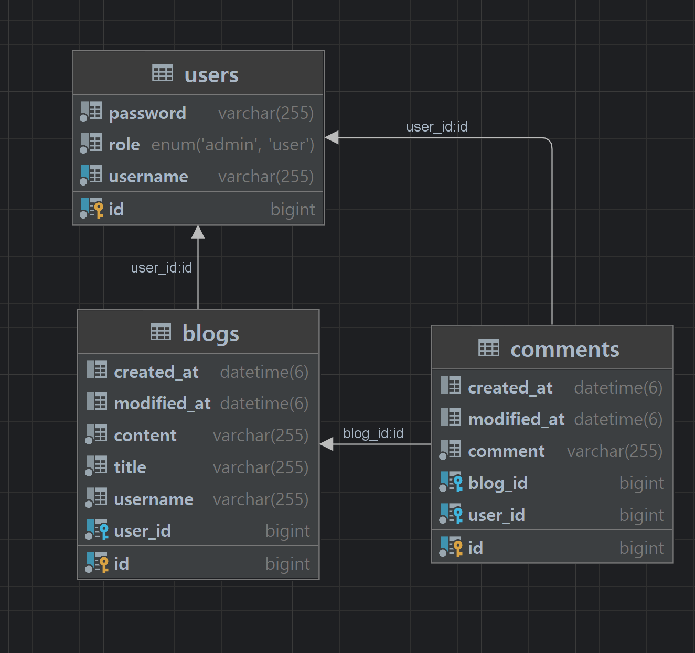
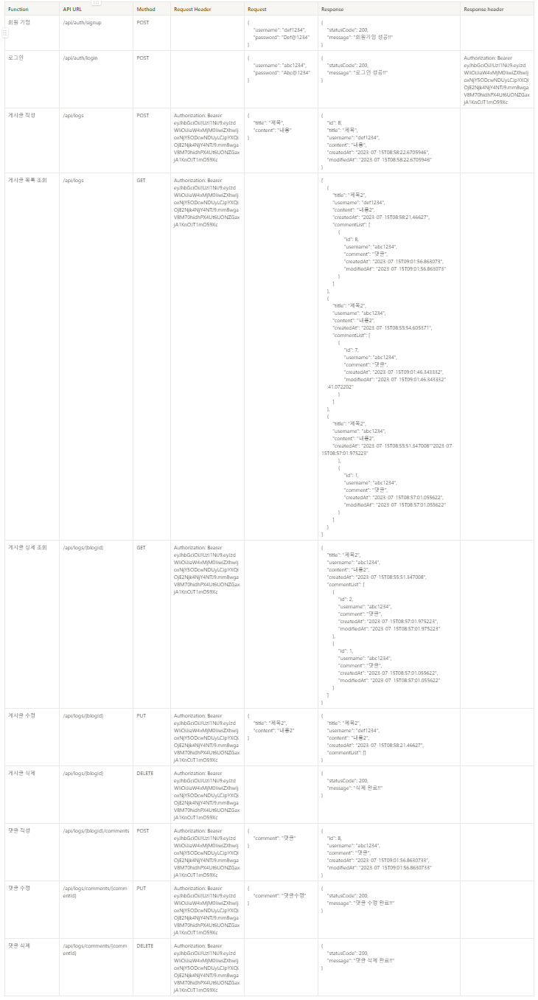

# SPRING.V3
"회원가입, 로그인 기능이 추가된 나만의 블로그 백엔드 서버 만들기"

---

ERD



API 명세서



[Notion 바로가기](https://verdureko.notion.site/Spring-Lv-3-0537254d110045168777e91cd61ee814)

---

1. API 명세서 설계의 중요성

   피드백 해주신대로 URL을 단수 -> 복수로 변경했고 계층구조를 반영하여 변경하였습니다.

   컨벤션에 대해 공부가 필요하다 느꼈고 평소 웹서비스 이용시 주의깊게 보지않았던 URL도 구조상의 이유가 있다 느꼈습니다.

   물론 연관관계나 요청과 응답에 대해서 잘 알고있을때의 경우겠지만 첫 설계를 시간을 들여 잘하면 오히려 작업시간이 줄어들 수 있겠다 느꼈습니다.

2. ERD를 먼저 설계한 후 Entity를 개발했을 때의 장점

   수정 작업을 줄일 수 있고 클래스간의 관계를 파악하기 용이하다.

3. JWT를 사용하여 인증/인가를 구현 했을 때의 장점

   인증을 위한 별도의 저장소가 요구되지않아 빠른 인증처리, 확장성이 우수함

4. JWT를 사용한 인증/인가의 한계점

   외부에서 접근하기 쉽고 노출 가능성으로 인해 저장할 수 있는 정보가 제한적이다

5. 댓글이 달려있는 게시글을 삭제하려고 할 때의 문제? JPA가 아닌 Database 테이블 관점에서 해결방법?

    ```sql
    ALTER TABLE 테이블명
    DROP CONSTRAINT 제약조건명;
    ```

   쿼리문으로 제약조건명도 삭제합니다.

6. 5번과 같은 문제가 발생했을 때 JPA에서의 해결방안

   외래키나 제약조건을 무효화하는 옵션을 적용합니다.

7. IoC / DI 에 대한 간략한 설명

   제어의 역전과 의존성 주입은 클래스 간의 느슨한 결합으로 코드의 유지보수 및 재활용을 용이하게 하는데 목적이 있습니다.
